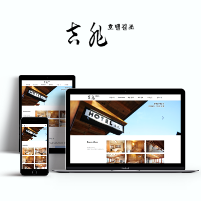

>#### 프로젝트에 사용한 모든 `호텔 관련 이미지의 저작권은 길조 호텔에 있음`을 알립니다.

# 프로젝트 - `길조 호텔` 

## 1. 프로젝트 간단 요약

`반응형` 웹페이지 기획, 디자인, 퍼블리싱.  
본인 기여도 : `100%`

기존의 길조호텔 웹사이트를 분석하고 리뉴얼 디자인 기획, 제작 후 퍼블리싱한 개인 프로젝트입니다.

---

## 2. 프로젝트에 사용한 Tools

- Design
  - `Affinity Photo`
  - `Adobe PhotoShop`
- Publishing
  - `Visual Studio Code `  

---

## 3. 프로젝트 컨셉 & 주요 목표

1. `그리드 시스템` 사용
2. `반응형 웹페이지` 제작
3. 불필요한 강조를 제외, 깔끔한 `메인컬러 3가지` #FFF, #000, #7B9ACC
4. 가독성 높은 고딕계열 폰트 `'Spoqa Han Sans Neo'`
